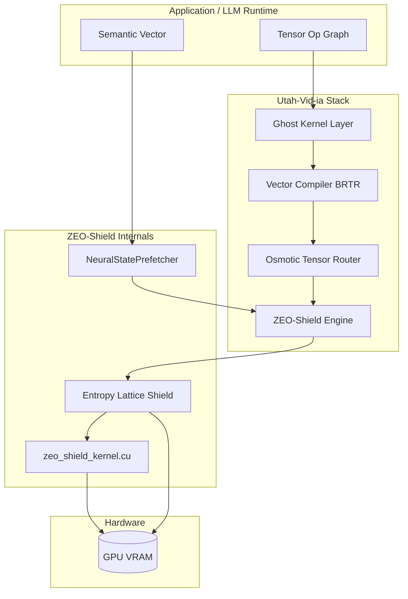
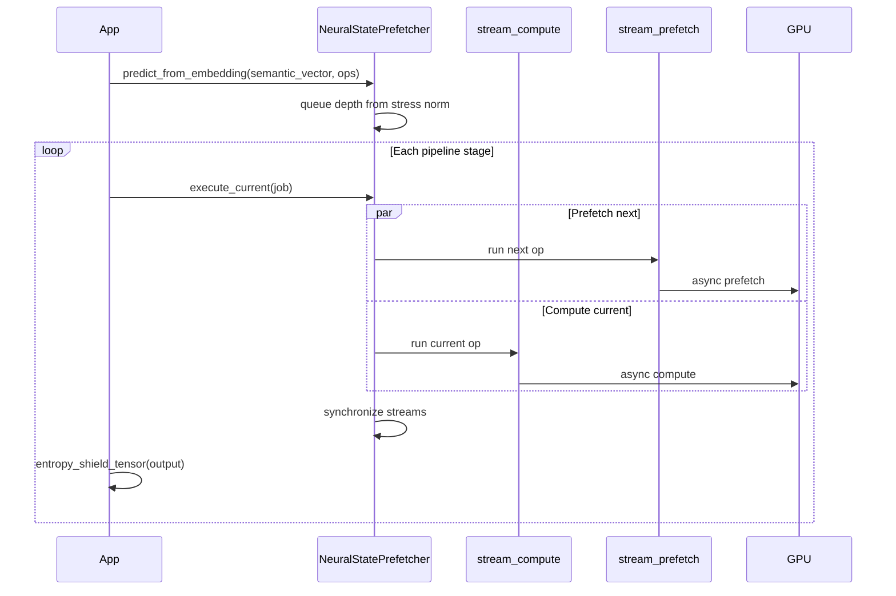
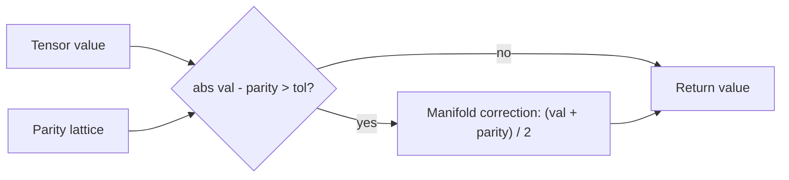
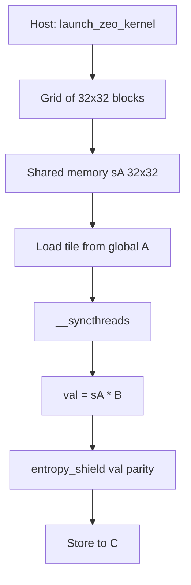

# ZEO-Shield Architecture

Visual reference for the Utah-Vid-ia Batch 4 stack: **Neural-State Pre-fetching** and **Entropy-Shield**.

## System overview



## Pre-Sight execution flow

Predictive prefetch uses dual CUDA streams: compute runs the current op while prefetch stages the next.



## Entropy-Shield manifold correction

Instead of hard ECC abort, divergent values blend toward local parity.



## CUDA kernel tile flow

`zeo_shield_kernel.cu` stages a 32×32 tile of `A` in shared memory, multiplies against `B`, then applies `entropy_shield`.



## Integration map

| Layer | Module | Role |
|-------|--------|------|
| Ghost translation | `utahvidia/core.py` | IR intercept, vendor abstraction |
| BRTR compiler | `utahvidia/compiler.py` | Triton JIT / PyTorch fallback |
| Fluid routing | `utahvidia/osmotic.py` | Multi-GPU load balance |
| Pre-Sight | `utahvidia/zeo_shield.py` | `NeuralStatePrefetcher` |
| Entropy lattice | `utahvidia/zeo_shield.py` | `entropy_shield_tensor` |
| Native kernel | `zeo_shield_kernel.cu` | CUDA prefetch + shield |

## Running benchmarks

```bash
py -m benchmarks.benchmark_zeo_shield --sizes 128 256 512 --iters 20
```

Native CUDA extension JIT-compiles on first use when `torch.cuda.is_available()` and NVCC is on `PATH`.
